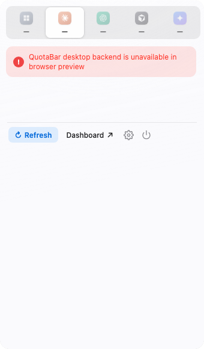

# QuotaBar

[](https://github.com/majiayu000/quotabar/actions/workflows/ci.yml)
[](LICENSE)

<p align="center">
  
</p>

QuotaBar is a Tauri v2 menubar app for monitoring Claude Code, Codex, Cursor, and Antigravity usage. It shows live quota windows, per-provider tray indicators, and local cost estimates from on-device logs.

## Features

- Overview: glass popover shell with provider summary tiles and real-data quota windows.
- Provider switcher: overview plus full-name cards for Claude, Codex, Cursor, and Antigravity.
- Claude quota: 5-hour, 7-day, Opus, Sonnet, and Claude Design windows.
- Codex quota: short and weekly ChatGPT usage windows, with reset times shown as days plus hours when available.
- Cursor quota: signed-in Cursor usage and request-limit windows when session data is available.
- Antigravity panel: placeholder provider status while quota tracking is pending.
- Local cost tracking: today, week, and month estimates for Claude Code, Codex, and Cursor.
- Per-provider tray icons: independent menu bar indicators for supported providers.
- Tray controls: enable or hide each tray while keeping at least one entry point.
- Settings view: theme, macOS Hide Dock, and per-provider tray controls keep their existing storage keys.
- Background polling: refreshes every 60 seconds, backs off to 5 minutes on 429, and backs off to 1 hour on Claude auth failures.
- Read-only Claude OAuth: reads Claude Code credentials from the correct source, but never refreshes or writes OAuth tokens.
- Hidden-window polling: disables macOS webview throttling so menubar mode keeps working.

## Demo Proof



This screenshot is captured from the production React UI in browser preview without a Tauri desktop backend. It intentionally includes no provider quota values, account identifiers, tokens, cookies, or sessions. Desktop widget and notification visuals are static design previews only until a runtime implementation ships. See `docs/demo-proof.md` for the capture scope and refresh steps.

## Quota Semantics

- Claude tray value:
  - prefers `weeklyTotal`
  - falls back to max of `weeklyOpus`, `weeklySonnet`, `weeklyDesign`, and `weeklyFable5`
  - falls back to current session usage
- Codex tray value:
  - prefers `secondary_window.used_percent`
  - falls back to `primary_window.used_percent`
- Cursor tray value:
  - uses Cursor quota percentage when available
- Antigravity tray value:
  - shows provider availability while usage tracking is pending
- Tray percentages represent used quota, not remaining quota.

## Project Layout

- Frontend:
  - `src/App.tsx`
  - `src/components/*`
  - `src/services/backend.ts`
  - `src/services/service_meta.ts`
  - `src/services/tray_visibility.ts`
  - `src/types/models.ts`
  - `src/utils/*`
- Backend:
  - `src-tauri/src/commands.rs`
  - `src-tauri/src/domain/models.rs`
  - `src-tauri/src/services/claude.rs`
  - `src-tauri/src/services/codex.rs`
  - `src-tauri/src/services/cursor.rs`
  - `src-tauri/src/services/antigravity.rs`
  - `src-tauri/src/services/cost.rs`
  - `src-tauri/src/services/http.rs`
  - `src-tauri/src/services/tray.rs`
  - `src-tauri/src/services/tray_icon.rs`
  - `src-tauri/src/services/window.rs`
- Release notes:
  - `CHANGELOG.md`
  - `docs/release.md`

## Requirements

- macOS or Windows
- Node.js with npm
- Rust toolchain
- Tauri prerequisites installed
- Claude Code login for Claude quota and cost data
- Codex login for Codex quota and cost data
- Cursor sign-in or `CURSOR_SESSION_TOKEN` for Cursor quota data
- Antigravity installed for Antigravity provider status

## Development

```bash
npm ci
npm run tauri dev
```

## Build

Frontend and Rust verification:

```bash
npm ci
npm test
npm run build
cargo fmt --manifest-path src-tauri/Cargo.toml --check
cargo check --manifest-path src-tauri/Cargo.toml
cargo test --manifest-path src-tauri/Cargo.toml
```

Local macOS app bundle:

```bash
npm run tauri build -- --bundles app
```

`src-tauri/target/release/bundle/macos/QuotaBar.app`

Downloadable release bundles:

```bash
# macOS
npm run tauri build -- --bundles dmg

# Windows
npm run tauri build -- --bundles msi,nsis
```

Expected output locations:

`src-tauri/target/release/bundle/dmg/`
`src-tauri/target/release/bundle/msi/`
`src-tauri/target/release/bundle/nsis/`

## Release Artifacts

The latest published release is [QuotaBar v0.2.0](https://github.com/majiayu000/quotabar/releases/tag/v0.2.0).

Release candidates should be built by the `release-artifacts` GitHub Actions workflow or from a clean checkout, then attached manually to the matching GitHub release only after final human approval. The workflow uploads build artifacts for inspection; it does not publish a GitHub Release. See [docs/release.md](docs/release.md) for the release checklist.

## Install / Run

For normal use, download the current installer from [GitHub Releases](https://github.com/majiayu000/quotabar/releases/latest). For development, install from a local build.

macOS:

```bash
./scripts/stop_app.sh
./scripts/install_app.sh
./scripts/run_app.sh
```

Or one-shot restart after rebuild:

```bash
./scripts/reinstall_and_run.sh
```

Windows:

- Download the `.msi` or `.exe` from GitHub Releases.
- Build installer: `npm run tauri build -- --bundles msi,nsis`
- Install from the generated `.msi` or `.exe`

## Verification

```bash
npm test
npm run build
cargo fmt --manifest-path src-tauri/Cargo.toml --check
cargo check --manifest-path src-tauri/Cargo.toml
cargo test --manifest-path src-tauri/Cargo.toml
npm run tauri build -- --bundles app
```

## Limitations

- QuotaBar reads local provider auth state; it does not manage provider login flows.
- Claude quota depends on Claude Code OAuth credentials and Anthropic's current usage response shape.
- Codex quota depends on `~/.codex/auth.json` and ChatGPT usage windows returned by the current backend API.
- Cursor quota requires Cursor sign-in or `CURSOR_SESSION_TOKEN`.
- Antigravity support currently reports provider availability only; quota windows are not exposed yet.
- Cost estimates are derived from local logs and may be empty until provider tools have written usage history.

## Troubleshooting

- Tray icon flashes then disappears:
  - check menu bar manager hidden area, such as Ice or Bartender
  - ensure the app is not auto-grouped into hidden extras
- No Claude quota data:
  - macOS: ensure Claude Code login exists in Keychain with `claude login`
  - Windows/Linux: set `CLAUDE_CODE_OAUTH_TOKEN`
  - if Claude auth fails, re-login with Claude Code and click Refresh
- No Codex quota data:
  - ensure `~/.codex/auth.json` is valid
  - run the `codex` login flow again if the token expired
- No Cursor quota data:
  - sign in to Cursor
  - or set `CURSOR_SESSION_TOKEN`
- Antigravity quota is pending:
  - Antigravity support currently exposes provider status, not quota windows
- Persistent 429 rate limiting:
  - QuotaBar uses a Claude Code user agent and serves stale cached data when available
  - polling backs off to 5 minutes after 429 responses
- Cost data is empty:
  - local logs may not exist yet
  - costs are estimated offline from local Claude/Codex logs via `ccstats`

## Support and Security

- Bugs and feature requests: use GitHub issues.
- Security or credential exposure: use GitHub private security advisories. Do not paste provider tokens, cookies, session files, or local auth material into public issues.
- Contributor setup and expectations: see [CONTRIBUTING.md](CONTRIBUTING.md).
- Security scope and reporting: see [SECURITY.md](SECURITY.md).

## License

MIT
