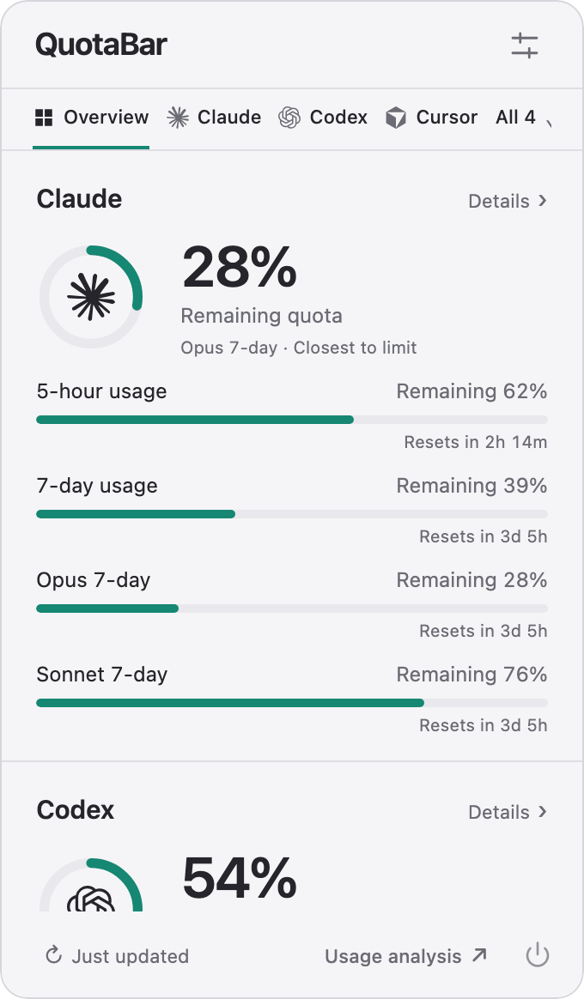
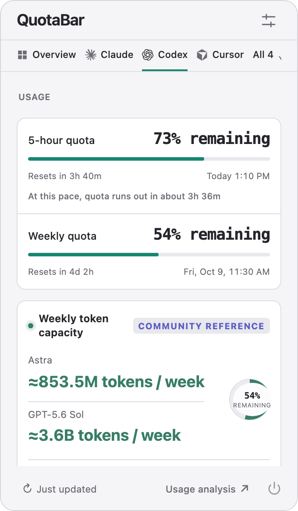
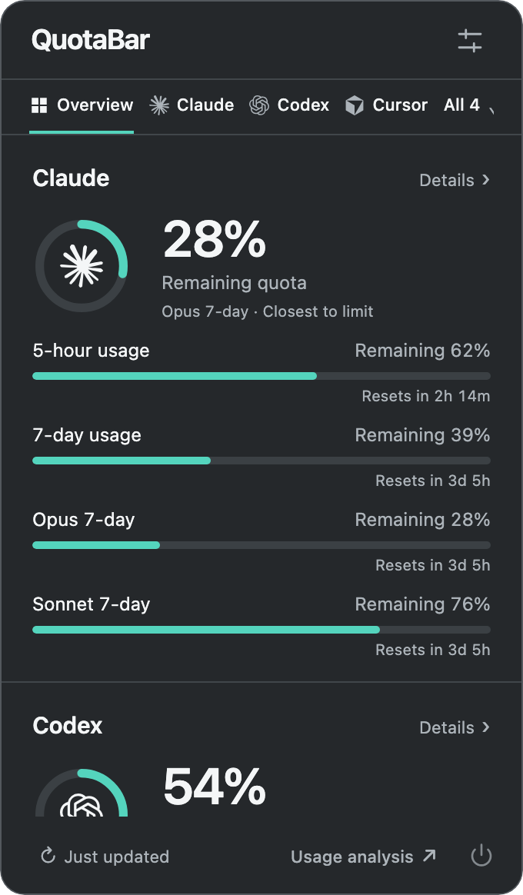
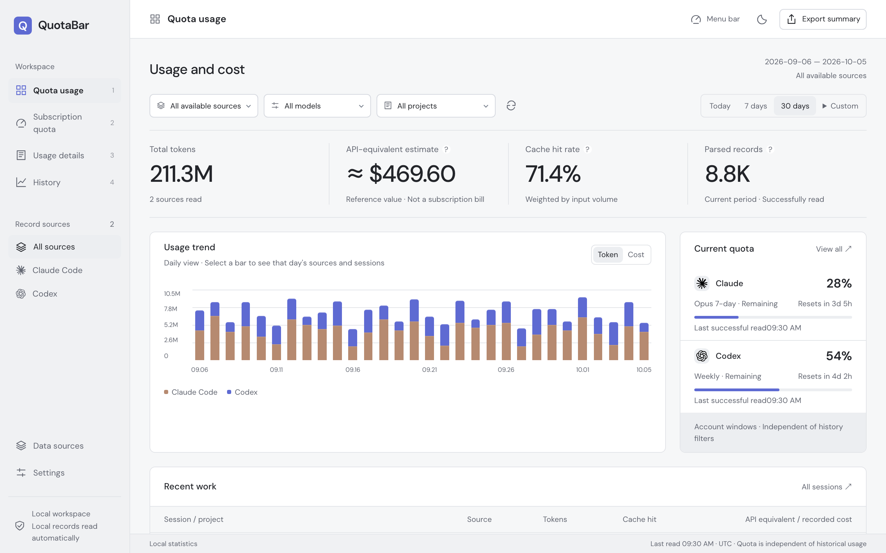

# QuotaBar

[](https://github.com/majiayu000/quotabar/actions/workflows/ci.yml)
[](LICENSE)

<p align="center">
  
</p>

See which AI coding quota is closest to its limit, when it resets, and where
your local usage went. QuotaBar combines a tray monitor and desktop analysis
for Claude Code, Codex, Cursor and Grok Build. Antigravity is hidden until
QuotaBar can track its quota.

[Website](https://majiayu000.github.io/quotabar/) ·
[Download installers](https://github.com/majiayu000/quotabar/releases/latest) ·
[Installation and first run](#install--run) · [Build from source](#development)

## Download and first run

1. Download the installer for your OS and CPU from
   [the latest release](https://github.com/majiayu000/quotabar/releases/latest).
   Normal use does not require Node.js or Rust.
2. Open QuotaBar and click its tray icon. Sign in through your provider's own
   application/CLI, then use **Check connection**. QuotaBar reads existing
   sign-ins and delegates expired Grok session renewal to the installed Grok
   CLI. Interactive sign-in stays with the provider.
3. Overview shows remaining quota and reset windows. Open **Usage analysis**
   for local projects, sessions and history. Unavailable or stale readings stay
   labeled; API-equivalent values are estimates, not subscription bills.

See the release's installation/signing notes for that exact build. Interface
scaling is available since v0.5.6. The original Windows 10 / 27-inch 2K case
still needs confirmation in [GH186](specs/GH186/tasks.md).

## How the projects fit together

[agent-sessions](https://github.com/majiayu000/agent-sessions) reads native
session records and preserves provenance.
[ccstats](https://github.com/majiayu000/ccstats) handles local accounting,
pricing and CLI/SDK/machine interfaces. QuotaBar uses its published SDK and owns
the tray, desktop analysis, alerts and settings. Install QuotaBar to use the app;
you do not need to install those libraries or the separate ccstats desktop.
See [product boundaries](PRODUCT.md) and [delivery status](docs/product/delivery-status.md).

## Features

- Overview: large account rings and quota windows, with remaining quota and optional weekly detail. The headline always identifies the most constrained window; stale readings stay marked and provider details remain one click away.
- High-usage tips explain remaining quota and reset timing; stale data does not produce usage advice.
- Exhaustion estimate: each quota window with a reset time shows whether it runs out before the reset at the recent pace (for example "Estimate: at this pace, runs out ~15:40 (before 18:00 reset)"); the overview headline shows only the before-reset case. The burn rate is a least-squares fit over the last 60 minutes of successful reads, kept in memory; it needs at least 4 readings spanning 15 minutes and a rising slope. A usage drop or a moved reset time starts a new history. Flat or falling usage, readings older than 10 minutes, and failed reads show no estimate. Where the estimate is unavailable, the Claude 5-hour and Codex short windows keep their whole-window average pace.
- Headroom hint: when the most constrained window across visible accounts has 20% or less remaining, or is estimated to run out before its reset, the overview shows one hint naming another connected account with at least 40% remaining and 30 points more (compared by that account's own most constrained window), plus its reset time. Accounts with failed reads, readings older than 10 minutes, or hidden providers (Antigravity) are never used.
- Provider switcher: overview, up to three saved favorites, and an All picker with search and connection/usage status. The picker follows account visibility settings.
- Claude quota: 5-hour, 7-day, Opus, Sonnet, and Claude Design windows.
- Codex quota: short and weekly ChatGPT usage windows, local weekly pace and API-equivalent value estimates, and an exhausted-week layout that keeps the last estimate and a clickable bonus reset.
  Observed usage is valued at standard API token prices; the full-week value is a rough extrapolation from an official quota snapshot, not a bill or an official dollar allowance. Fast-mode premiums and purchased credits are not represented by this estimate.
- Cursor quota: signed-in Cursor usage and request-limit windows when session data is available.
- Grok quota: SuperGrok weekly (or monthly) credits pool, product mix for Build/Chat/Imagine/Voice/API, extra credits, and an API-equivalent value estimate from ccstats' durable inference ledger.
- Antigravity: hidden from the switcher, overview, settings, favorites and menu bar until quota tracking exists. Saved preferences that mention it are ignored.
- Local cost tracking: today, week, and month estimates for Claude Code, Codex, and Cursor.
- Subscription value: optional monthly plan prices (Settings → Accounts, empty by default) let the desktop workspace compare this or last calendar month's local API-equivalent estimate with what you pay per Claude, Codex, Cursor and Grok plan, as a value multiple. Incomplete pricing shows `≥`, estimates `≈`, unavailable values `—`; GPT-Reserve complimentary usage is excluded from Codex. Export it as JSON or a light SVG share card; hiding source names leaves only combined totals. It is an estimate from local logs, not a bill.
- Per-provider tray icons: independent menu bar indicators for supported providers.
- Tray controls: enable or hide each tray while keeping at least one entry point.
- Settings view: Display / Alerts / Accounts pages, with quota display preferences, theme, macOS Hide Dock, Launch at Login, All / single-service presets, and per-provider tray controls. Launch at Login uses the OS login item rather than a local storage key.
- Notifications: 80%, 95%, 100%, unused bonus reset, and bonus-expiry alerts.
- Background polling: refreshes every 60 seconds, backs off to 5 minutes on 429, and backs off to 1 hour on Claude auth failures.
- Read-only Claude OAuth: reads Claude Code credentials from the correct source, but never refreshes or writes OAuth tokens.
- Grok auth: checks `~/.grok/auth.json` on each polling cycle. When a credential has a refresh token and is inside the CLI's early-invalidation window (300 seconds by default, or `GROK_AUTH_EARLY_INVALIDATION_SECS`), runs the installed official `grok models` command to let Grok renew and save its own credentials, then rereads them before requesting quota. Renewal rereads the same selected account record. Successful renewal keeps immediate authentication recovery available. A billing 401/403 also runs renewal once when the rejected credential still has a refresh token, rereads credentials, and retries billing once; failed renewal or a second authentication rejection stays disconnected. This does not start a conversation. QuotaBar waits up to 20 seconds per request, then lets the CLI finish saving credentials in the background. Automatic and manual refreshes do not start another helper while it is running. Unsuccessful automatic renewal retries after 5 minutes; manual refresh can retry after the helper exits. Proactive renewal errors keep matching-account snapshots younger than 15 minutes as last known data with the error attached; unknown or ambiguous account identities cannot reuse a snapshot. Confirmed authentication rejection and failed rejection-driven renewal remain disconnected. QuotaBar never writes tokens itself or logs CLI output. If renewal remains unavailable, open `grok` and sign in only if prompted.
- Hidden-window polling: disables macOS webview throttling so menubar mode keeps working.

## Demo Proof

<p>
  
  
  
</p>



These screenshots show **illustrative data**. They were captured on 2026-10-05 from a production build of the QuotaBar `v0.5.9` React UI in Chromium, with a deterministic mock desktop backend injected by `scripts/capture_demo_screenshots.mjs`. The quota percentages, token totals, costs, projects and session titles are invented; no provider account, email, account id, token, cookie or local record was read. The mock only exists in that capture script and is not part of the app bundle. The screenshots show the interface, not native backend connectivity or signed/notarized artifacts. A dark workspace variant is in `docs/assets/quotabar-demo-workspace-dark.png`. See `docs/demo-proof.md` for the capture scope and refresh steps.

## Quota Semantics

- Claude tray value:
  - uses the hottest Claude window (same ranking as the overview/header)
  - includes the 5-hour session, 7-day All models (`weeklyTotal`), Opus, Sonnet, Design, and Fable 5 windows
  - keeps `weeklyTotal` as a labeled card, not the implicit tray or 80/95 alert headline
- Codex tray value:
  - prefers `secondary_window.used_percent`
  - falls back to `primary_window.used_percent`
- Cursor tray value:
  - prefers Cursor Models (`autoPercent`)
  - falls back to the overall Cursor quota percentage
- Grok tray value:
  - uses the shared SuperGrok credits pool percent (`creditUsagePercent`)
- Antigravity has no tray icon while it is hidden.
- Tray percentages and rings represent remaining quota.
- All quota numbers, rings, and bars consistently display remaining quota. Hiding weekly detail does not remove a weekly limit from headline selection. Low remaining quota retains warning and critical colors.

## Project Layout

- Frontend:
  - `src/App.tsx`
  - `src/components/*`
  - `src/services/backend.ts`
  - `src/services/service_meta.ts`
  - `src/services/tray_visibility.ts`
  - `src/types/models.ts`
  - `src/utils/*`
- Backend:
  - `src-tauri/src/commands.rs`
  - `src-tauri/src/domain/models.rs`
  - `src-tauri/src/services/claude.rs`
  - `src-tauri/src/services/codex.rs`
  - `src-tauri/src/services/cursor.rs`
  - `src-tauri/src/services/grok.rs`
  - `src-tauri/src/services/antigravity.rs`
  - `src-tauri/src/services/cost.rs`
  - `src-tauri/src/services/http.rs`
  - `src-tauri/src/services/tray.rs`
  - `src-tauri/src/services/tray_icon.rs`
  - `src-tauri/src/services/window.rs`
- Release notes:
  - `CHANGELOG.md`
  - `docs/release.md`

## Requirements

- macOS, Windows, or Linux
- Node.js with npm
- Rust toolchain
- Tauri prerequisites installed
- Claude Code login for Claude quota and cost data
- Codex login for Codex quota and cost data
- Cursor sign-in or `CURSOR_SESSION_TOKEN` for Cursor quota data
- Grok Build login (`grok login`) for Grok quota data

## Language

Settings → Display → Interface size offers **100%**, **125%**, and **150%**. It scales text and controls in both windows and is remembered across restarts. The tray resizes and stays anchored to its icon; content scrolls when screen space is limited.

Settings → Display → Language offers **Follow system**, **简体中文**, and **English**.
Both the menu bar panel and desktop workspace update immediately and share the
saved preference. Chinese system locales use Simplified Chinese; other system
locales use English. Quota data, current navigation and provider polling survive
language changes.

UI messages live in `src/i18n/en.ts` and `src/i18n/zh-CN.ts`. See [the i18n architecture](docs/i18n.md)
for rendering, stored messages, formatting and extension rules.

## Development

QuotaBar starts as a menu bar app. Click a tray icon for the quota popover.
A resizable desktop workspace (Overview, Quota, Usage, History, Sources, and
Settings) is optional: open it from the tray menu. It does not open on launch. Closing the workspace keeps tray
monitoring running; Quit exits the application.

Local analytics use one filtered ccstats report for summaries, projects,
sessions, daily/hourly history, activity, and period comparisons. Missing source
data and incomplete pricing are shown explicitly. API-equivalent estimates are
not subscription bills. Session titles come from existing source metadata or
local manual names, with no model summarization. JSON/SVG summary exports omit
session titles and paths.

The latest matching report is cached locally for quick startup while fresh
analysis runs in the background. First-run loading has a reduced-motion-aware
animation. Invalid Claude credentials require login before a quota request;
failed reads wait for a manual recheck, with rate-limit deadlines still applied.

The repositories remain separate. QuotaBar depends on the published ccstats
0.9.1 SDK from crates.io; Cargo.lock pins the resolved version. Claude/Codex
parsing is shared through
agent-sessions. The SDK excludes the independent gpt-reserve pool from subscription
week estimates while retaining it in general usage, and includes Grok 4.7 pricing.
No local SDK archive or patch preparation is needed. Official quota percentages
remain provider-reported; ordinary Luna usage is not excluded.

Cost estimates automatically use the SDK's public
[LiteLLM price catalog](https://github.com/BerriAI/litellm/blob/main/model_prices_and_context_window.json).
The SDK downloads it when no fresh price cache exists and refreshes it after
24 hours. Once a new model is included in that catalog and recognized by the
SDK, its prices become available without a QuotaBar release. Only the public
catalog is fetched; local usage logs are processed on-device. If the download
fails, the SDK uses its existing cache or bundled prices; models without a known
price remain unavailable rather than being shown as free.

For GPT-6.1 Sol, the catalog supplies the
[standard API prices](https://developers.openai.com/api/docs/pricing): $2 input,
$0.10 cached input, $2.50 cache writes, and $10 output per million tokens.
Above 272K input tokens, the full request uses $4 input, $0.20 cached input,
$5 cache writes, and $15 output. These are API-equivalent estimates, not
subscription charges. The dated GPT-5.6 Sol weekly reference below remains
specific to that model.

Weekly token capacity shows only **Astra** and **GPT-5.6 Sol**. It defaults to
the local estimate when available. Click the source badge to switch between
local and community values; the badge flips horizontally and respects reduced
motion. Switching does not refetch usage or change the official quota percentage.

Local conversion uses all matched token records in the current weekly window,
including cached input. Divide their API-equivalent cost by the official used
fraction to estimate the full-week value. Reprice those same input/cache/output
tokens as Astra, then calculate `weekly value / Astra replay cost × observed
tokens`. This works with mixed-model usage and does not require a continuous
single-model span or five percentage points of usage. Sol shows its API-price
equivalent: Astra tokens × 2.5. The
[Astra](https://openai.com/index/gpt-6-astra/) and
[Sol](https://developers.openai.com/api/docs/models/gpt-5.6-sol) standard API
input/cached-input/output prices checked on September 16, 2026 have the same
2.5 ratio. This is price conversion, not a measured Sol subscription allowance.

The **community reference** view shows Astra ≈853.5M and Sol ≈3.6B tokens per
full week, including cached
input. These factual results come from [Codex Weekly Quota
Observatory](https://codex-quota.manetli.com/data/), snapshot
`2026-09-16T08:50:43.414Z`, one Pro 20× account at Standard speed. They are not
scaled to or presented as the current account's allowance. The source and date
are shown in the panel; the reference values and dated price ratio live in
`src/services/codex_weekly_reference.json`.
If local data or Astra pricing is unavailable, the panel uses the community view
and disables the switch with an explicit unavailable label.

The two rows represent alternative uses of one quota and cannot be added.
Other devices, cloud usage and workload changes can skew local estimates.
Official remaining percentages stay provider-reported. The mixed-workload
API-equivalent value and any local valuation errors remain in collapsed details.
SDK changes are tested and released in ccstats first, then adopted with an explicit Cargo dependency update.

```bash
npm ci
npm run tauri dev
```

## Build

Frontend and Rust verification:

```bash
npm ci
npm run release:check
npm test
npm run build
cargo fmt --manifest-path src-tauri/Cargo.toml --check
cargo check --manifest-path src-tauri/Cargo.toml
cargo test --manifest-path src-tauri/Cargo.toml
```

Local macOS app bundle:

```bash
npm run tauri build -- --bundles app
```

`src-tauri/target/release/bundle/macos/QuotaBar.app`

Downloadable release bundles:

```bash
# macOS, for the current host architecture
npm run tauri build -- --bundles dmg

# Windows
npm run tauri build -- --bundles msi,nsis

# Linux
npm run tauri build -- --bundles appimage
```

Expected output locations:

`src-tauri/target/release/bundle/dmg/`
`src-tauri/target/release/bundle/msi/`
`src-tauri/target/release/bundle/nsis/`
`src-tauri/target/release/bundle/appimage/`

## Release Artifacts

The latest published release is available from [GitHub Releases](https://github.com/majiayu000/quotabar/releases/latest).

Published `v*` tags build Developer ID signed and notarized macOS DMGs. Older GitHub Release assets such as v0.5.1 remain unsigned. Pull-request workflow artifacts stay unsigned tester builds.

Release candidates should be built by the `release-artifacts` GitHub Actions workflow or from a clean checkout, then attached manually to the matching GitHub release only after final human approval. The workflow uploads build artifacts and SHA-256 manifests for inspection; it does not publish a GitHub Release. See [docs/release.md](docs/release.md) for the release checklist and signing-secret requirements.

## Install / Run

With no saved panel preferences, the switcher shows detected services and keeps them accessible if a connection later fails. Use **Add service** for setup, or Settings to choose providers manually.

On first launch, Overview shows detected connections and instructions for signing in through each provider. Use **Check connection** after signing in. QuotaBar reads existing local sign-ins and delegates Grok session renewal to the installed Grok CLI; interactive sign-in stays with the provider. Antigravity quota tracking is still pending.

For normal use, download the current installer from [GitHub Releases](https://github.com/majiayu000/quotabar/releases/latest). For development, install from a local build.

macOS:

```bash
./scripts/install_app.sh
./scripts/run_app.sh
```

These macOS scripts operate only on `/Applications/QuotaBar.app`; they do not
launch or stop development binaries. `install_app.sh` stages the complete local
bundle before stopping the installed app, waits about five seconds for exit,
and replaces the bundle without retaining obsolete files. Failed staging or
shutdown leaves the installed bundle untouched.

Build and install the current checkout, then request launch:

```bash
npm run tauri build -- --bundles app
./scripts/reinstall_and_run.sh
```

`reinstall_and_run.sh` itself does not build. For development with hot reload,
use `npm run tauri dev`. `run_app.sh` fails if the installed app is missing;
it never falls back to an older local binary. A successful launch request does
not certify that the app stayed running.

Windows:

- Download the `.msi` or `.exe` from GitHub Releases.
- Build installer: `npm run tauri build -- --bundles msi,nsis`
- Install from the generated `.msi` or `.exe`

Linux x64:

- Download the `.AppImage` from GitHub Releases.
- Make it executable: `chmod +x QuotaBar_*.AppImage`
- Run it: `./QuotaBar_*.AppImage`

## Verification

```bash
npm run release:check
npm test
npm run build
cargo fmt --manifest-path src-tauri/Cargo.toml --check
cargo check --manifest-path src-tauri/Cargo.toml
cargo test --manifest-path src-tauri/Cargo.toml
npm run tauri build -- --bundles app
```

## Limitations

- QuotaBar reads local provider auth state; it does not manage provider login flows.
- Claude quota depends on Claude Code OAuth credentials and Anthropic's current usage response shape.
- Codex quota depends on `~/.codex/auth.json` and ChatGPT usage windows returned by the current backend API.
- Cursor quota requires Cursor sign-in or `CURSOR_SESSION_TOKEN`.
- Antigravity is hidden until QuotaBar can read its quota windows.
- Cost estimates are derived from local logs and may be empty until provider tools have written usage history.

## Troubleshooting

- Tray icon flashes then disappears:
  - check menu bar manager hidden area, such as Ice or Bartender
  - ensure the app is not auto-grouped into hidden extras
- No Claude quota data:
  - macOS: ensure Claude Code login exists in Keychain with `claude login`
  - Windows/Linux: set `CLAUDE_CODE_OAUTH_TOKEN`
  - if Claude auth fails, re-login with Claude Code and click Refresh
- No Codex quota data:
  - ensure `~/.codex/auth.json` is valid
  - run the `codex` login flow again if the token expired
- No Cursor quota data:
  - sign in to Cursor
  - or set `CURSOR_SESSION_TOKEN`
- Antigravity does not appear:
  - it is hidden until QuotaBar can track Antigravity quota
- Persistent 429 rate limiting:
  - QuotaBar uses a Claude Code user agent and serves stale cached data when available
  - polling backs off to 5 minutes after 429 responses
- Cost data is empty:
  - local logs may not exist yet
  - costs are estimated from local logs via `ccstats`, using automatically refreshed public prices

## Support and Security

- Bugs and feature requests: use GitHub issues.
- Security or credential exposure: use GitHub private security advisories. Do not paste provider tokens, cookies, session files, or local auth material into public issues.
- Contributor setup and expectations: see [CONTRIBUTING.md](CONTRIBUTING.md).
- Security scope and reporting: see [SECURITY.md](SECURITY.md).

## License

MIT
